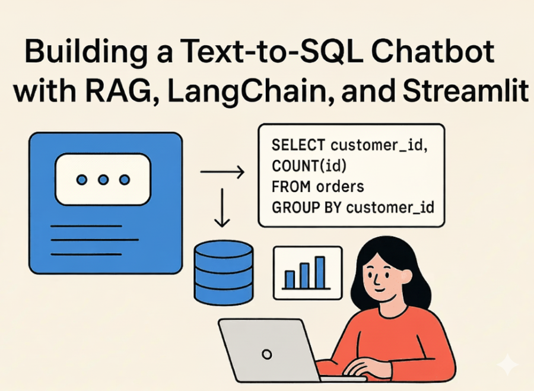
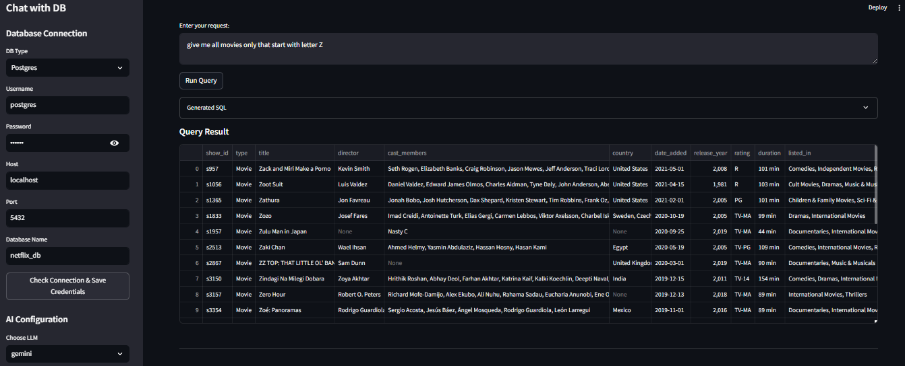
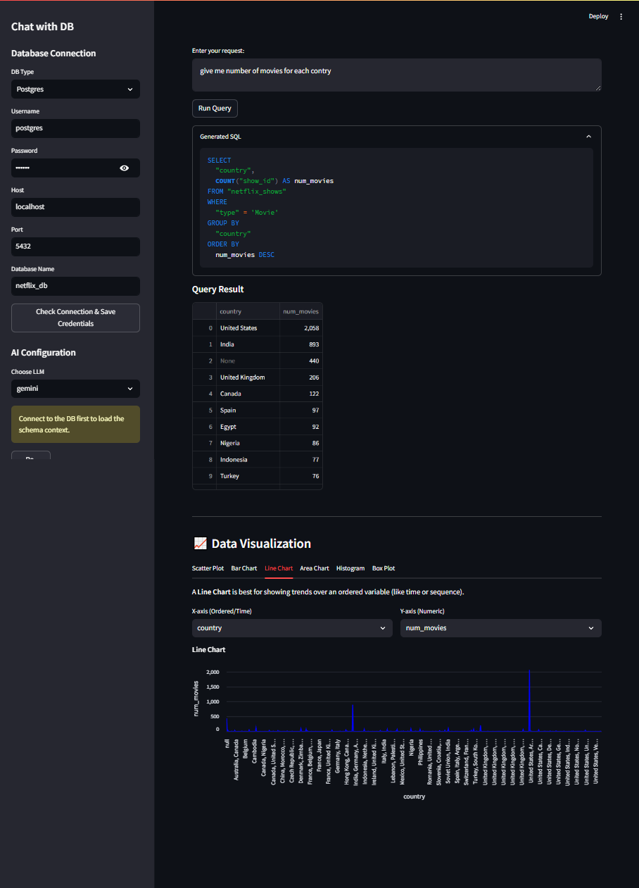
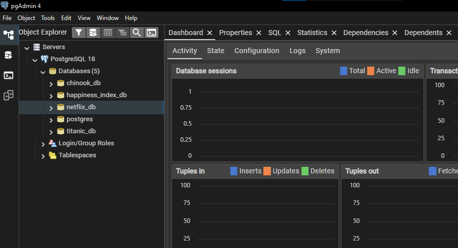
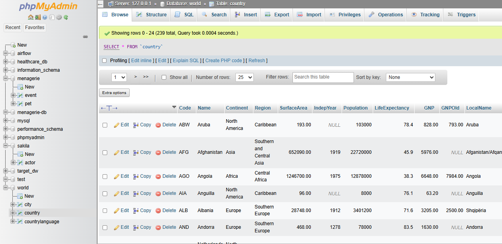

# Chat With DB - Text-To-SQL AI Agent

A powerful web application that transforms natural language questions into executable SQL queries against a PostgreSQL or MySQL database and visualizes the results. This project uses **Langchain (Ollama and ChromaDB)**, **LangChain** and **Streamlit** to provide a complete, end-to-end Chat With DB experience.

Demo :




---

## ✨ Features

 * **Natural Language to SQL (NL2SQL):** Converts plain English questions into optimized database queries.
 * **Multi-Database Support:** Seamlessly connect to **PostgreSQL** or **MySQL** databases.
 * **Persistent Connections:** Maintains database configuration and schema context using Streamlit's session state.
 * **Schema Indexing:** Indexes the database schema using **embeddings** (via LangChain's VectorStore) to provide the LLM with relevant context, avoiding prompt clutter.
 * **Interactive Visualization:** Dynamically generates charts (Scatter, Bar, Line, Area, Histogram, Box Plot) based on the query results.
 * **Persistent Results:** Query results (SQL and DataFrame) are persisted across user interactions, even when adjusting chart parameters.

---

## 🛠️ Installation and Setup

### 1. Prerequisites

You will need **Python 3.9+** and a running **PostgreSQL** or **MySQL** server to test the connectivity.

### 2. Clone the Repository

```bash
git clone https://github.com/drisskhattabi6/Text-To-SQL
cd Text-To-SQL
```

### 3. Setup Ollama (for Local Embeddings)

This project uses Ollama to run the local nomic-embed-text:latest model for generating database schema embeddings.
Install Ollama:

- Download and install the Ollama application for your operating system from the official website: [Download Ollama](https://ollama.ai/download)

- Pull the Embedding Model:

Once Ollama is running (it should start automatically), open your terminal and pull the required model:

```bash
ollama pull nomic-embed-text:latest
```

- Ensure Ollama remains running (the server icon is active) before launching the Streamlit app.

### 4. Setup Python Environment

It's highly recommended to use a virtual environment.

- Create and activate environment for Windows

```Bash
python -m venv venv
source venv/bin/activate 
```

- Create and activate environment for Windows

```Bash
python -m venv venv
./venv/Scripts/activate
```

- Install dependencies

```Bash
pip install -r requirements.txt
```

(Note: Ensure your requirements.txt includes streamlit, pandas, numpy, altair, langchain, psycopg2-binary (for Postgres), pymysql (for MySQL), and langchain-community for the Ollama integration and chromadb for the vector store.)

### 5. API Key Configuration (for LLM)

This project requires a large language model (LLM) API key (e.g., OpenAI, Gemini, etc.) for query generation. Set it as an environment variable:

- first rename '.env.example' to '.env'

```Bash
mv .env.example .env
```

- the set the API keys as environment variables

```Bash
export OPENAI_API_KEY='your_openai_key'
# OR
export GEMINI_API_KEY='your_gemini_key' 
```

If you want to use Ollama, you need to install a llm aside embedding model.

## 🚀 Usage


### 1. Run the Streamlit Application

Start the application from your terminal:

```Bash
streamlit run streamlit_app.py
```

### 2. Connect to Your Database

Navigate to the database configuration section (usually in the sidebar or a designated area).
Enter your database type (Postgres/MySQL) and credentials (Host, Port, User, Password, DB Name).
Click "Connect and Ingest Schema". The application will confirm the connection and load the table structure.

### 3. Ask a Question

In the main text area, enter your question (e.g., "What is the average order total per customer?")
Click "Run Query".
The application will display the generated SQL and the resulting data table.

### 4. Visualize Data

Below the result table, use the Data Visualization tabs to interactively select columns and generate various charts (Bar, Scatter, Line, etc.) based on the query results.

## 🖼️ Screenshots









## ⚙️ Project Structure (Simplified)

```
Text-To-SQL/
├── streamlit_app.py      # Main Streamlit application and UI logic
├── ai_agents/            # AI Agent with LangGraph, The core logic for generating SQL
├── helpers.py            # Database connection and schema fetching helpers
├── chroma_store/         # Local directory for the vector store
├── requirements.txt      # Python dependencies
└── .env/                 # API keys for LLM
```

## 🤝 Contributing

Contributions are welcome! Feel free to fork the repository, make improvements, and submit a pull request.


## DB Examples

Here you can Find some DB examples for testing the application.

### PostgreSQL

- https://neon.com/postgresql/postgresql-getting-started/postgresql-sample-database
- https://github.com/neondatabase-labs/postgres-sample-dbs


### MySQL
- https://dev.mysql.com/doc/index-other.html
